# Automatic Card Dealer

A robot that deals playing cards to multiple players around a table. A single central motor rotates the whole mechanism to aim at each player in turn, a brushless motor launches the card, and a closed-loop sensor confirms the card actually left before moving on. Everything runs on one ESP32-S3.

This was a project to get hands-on with real-time motion control on a microcontroller: writing a PID controller with a proper trajectory planner from scratch, and driving the ESP32's hardware pulse-counter peripheral directly instead of reaching for a library.

## Demo

Click a thumbnail to play the video (GitHub only plays video on the file's own page, not inline in the README).

[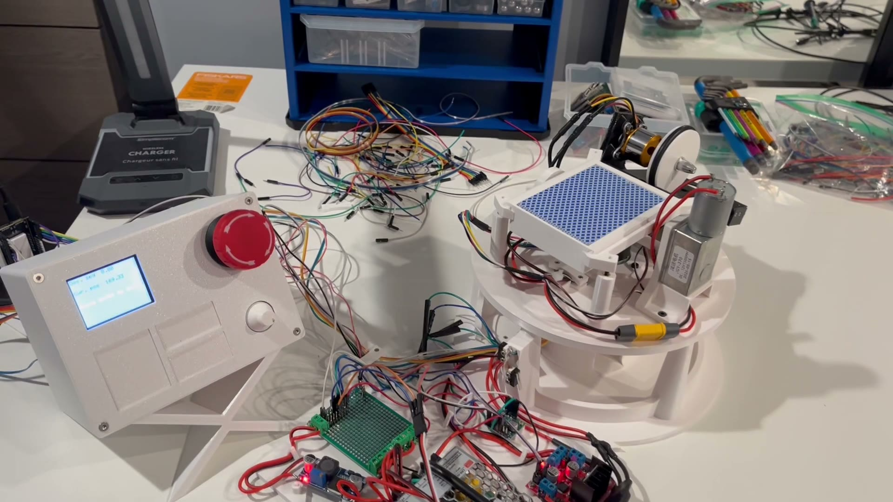](media/demo/deal-demo.mp4)

*PID driving to a sequence of positions, firing a card at each one, then moving to the next, simulating a full deal around the table. The VCNT2030 proximity sensor gives closed-loop confirmation that a card actually launched before the robot advances, so a jam or misfeed doesn't get treated as a successful deal. This clip is from an earlier hardware revision.*

| | |
|---|---|
| [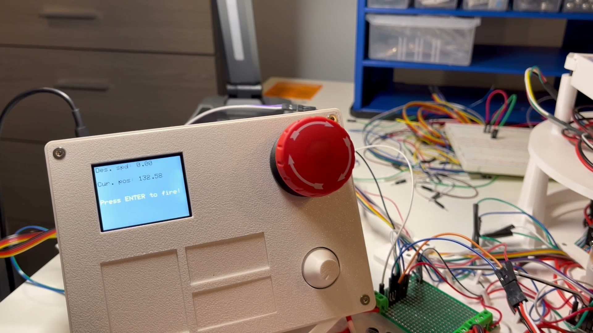](media/demo/teleoperation.mp4) | **Teleoperation.** Manually driving the central axis with the control box knob. |
| [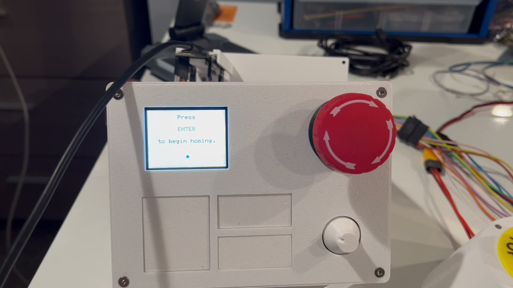](media/demo/homing-sequence.mp4) | **Homing sequence.** Automatic homing against the limit switches on power-up. |
| [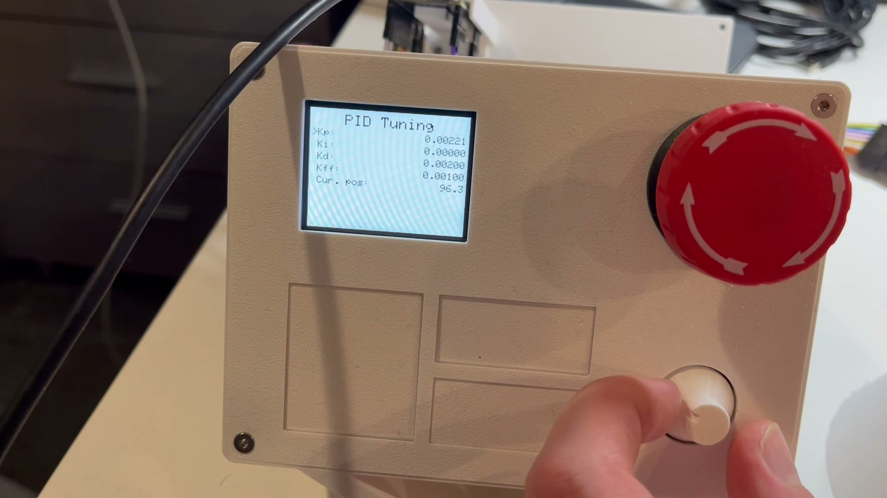](media/demo/pid-tuning.mp4) | **PID tuning.** Live on-device menu for tuning `K_p`, `K_i`, `K_d`, `K_ff` and driving to a test position, no reflashing required. |
| [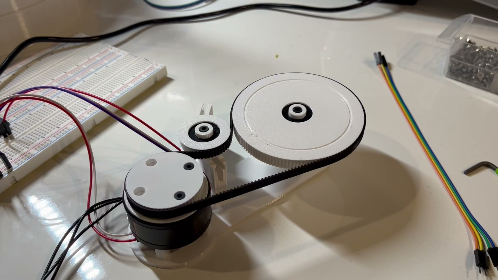](media/demo/belt-drive-test.mp4) | **Belt-drive prototype.** GT2 belt + BLDC + SimpleFOCMini test rig for the next revision of the axis (see [Future work](#future-work)). |

## How it works

The robot is built around one rotating stage (the "central axis") that carries the card deck and launcher. To deal a card, it rotates to a player's angle, spins up the launch motor, and feeds a card into it with a roller; a proximity sensor confirms the card left before the sequence continues.

- **Central axis**: a Pololu gear motor with a quadrature encoder, driving the whole assembly on a lazy-susan bearing. Position is closed-loop via a custom PID controller (see below), or it can be driven open-loop from the control box knob.
- **Launcher**: a drone BLDC motor with an O-ring mounted on a disc, spun up to grip and shoot the card once it's fed into it.
- **Feeder**: a JGY-070 worm gearmotor turning a rod fitted with rollers pulled from a printer, which slowly pushes one card at a time out toward the launcher.
- **Card detection**: a VCNT2030 IR proximity sensor watches the launch point so the firmware knows a card was actually dealt, rather than assuming it based on timing.
- **Homing**: limit switches on both ends of travel let the robot find its zero position and travel limits automatically on startup, with no manual calibration.
- **Control box**: three mechanical-keyboard switches, a 240x320 SPI TFT, and a rotary knob (an AS5600 magnetic encoder under the hood) for menu navigation, manual jogging, and live PID tuning.
- **E-stop**: a physical emergency stop button for cutting the motors.

Everything (motion control, sensor polling, the menu system, and the display) runs on a single ESP32-S3 (Arduino framework, PlatformIO). The display is driven on its own FreeRTOS task pinned to core 0 so redrawing the UI never blocks the control loop.

## Central axis motion control

The central axis needs to land on a target angle accurately and repeatably; dealing to the wrong spot, or overshooting into a player, isn't acceptable. It's driven by a PID controller I wrote for this project ([`pid_controller.cpp`](code-esp32/src/pid_controller.cpp)), not a library, tracking a **quintic (5th-order) polynomial trajectory** rather than chasing the setpoint directly.

**Why a trajectory planner instead of just a setpoint.** Feeding a PID loop a step input (jump straight to the goal angle) begs for overshoot and a jerky start/stop, which is rough on the gearbox and the coupling. Instead, `plan_quintic()` computes a smooth minimum-jerk profile between the start and goal angle: position, velocity, and acceleration are all continuous, and both velocity and acceleration are exactly zero at the endpoints. The move duration is scaled by how far the axis has to travel (`T_ms = max(T_ms_min, |Δangle| / angular_speed)`), so short moves aren't forced to take as long as long ones.

**The control law** combines four terms every cycle:

- **P** on position error (planned position vs. measured encoder angle)
- **I** on accumulated position error, with **anti-windup**: the integral only accumulates while the output isn't saturated, so it can't wind up during a stall or a move that's temporarily maxed out at ±1.0
- **D** on *velocity* error, comparing the planner's target velocity against the measured velocity
- **Feedforward** on the planner's target velocity, so the motor is already being driven at roughly the right speed before the feedback terms have to correct for anything

Velocity isn't read directly off the encoder; it's a finite difference of successive angle readings, smoothed with an exponential low-pass filter (`α = 0.2`) so encoder quantization noise doesn't get amplified into a noisy derivative term and fed back into the motor.

One deliberate departure from textbook PID: once the controller has decided which direction to move, it adds a fixed minimum-speed offset before sending the command to the motor driver. The gear motor has enough static friction that small commanded speeds near zero just stall rather than moving, and a plain PID output tends to hover in that dead zone as it approaches the goal. The minimum-speed kick keeps the motor actually turning through the whole approach, which is what gets the steady-state accuracy down.

The result is final-position accuracy consistently **under 2°**. Because it's an on-device tunable loop rather than baked-in constants, all four gains can be adjusted live from the control box's PID tuning menu (see the demo above) while watching the axis respond in real time, no reflash, no recompiling.

For offline analysis, the firmware also prints structured `>name:series(x,y)` lines over serial for the planned/measured position and velocity each cycle, which [`plot-pid/plot.py`](plot-pid/plot.py) reads and live-plots: an arbitrary number of named plots, each with an arbitrary number of lines, built up automatically from whatever the firmware prints. That's how the gains were actually tuned and how the `<2°` figure was verified.

## Quadrature decoding on the ESP32's PCNT peripheral

The central axis encoder is read entirely in hardware rather than in software. The ESP32-S3 has a dedicated **PCNT (Pulse Counter) peripheral** that can count encoder edges without touching the CPU: no interrupt handler in the hot path, no risk of missing an edge if something else briefly blocks the core.

Rather than a wrapper library, [`axis_control.cpp`](code-esp32/src/axis_control.cpp) configures the PCNT unit directly against `driver/pcnt.h`. Standard single-channel PCNT usage only counts edges on one signal and reads direction off the other, giving 2x decoding. To get full **4x decoding** (counting every edge of both encoder channels A and B), two PCNT channels are configured against the *same* physical pins with the roles swapped:

- **Channel 0**: pulses on A, gated by B, with B's level-control action inverted
- **Channel 1**: pulses on B, gated by A, with A's level-control action inverted

Each channel counts both the rising and falling edge of its own pulse input, and the other line's level (inverted on one channel, kept on the other) determines whether that edge counts up or down. Between the two channels, every edge on every line contributes a count, quadrupling the effective resolution over the raw encoder without any additional hardware. The peripheral's built-in glitch filter is also enabled (`pcnt_set_filter_value(100)`), rejecting short noise pulses on the encoder lines entirely in hardware.

Reading the position is then just a register read (`pcnt_get_counter_value`), converted to degrees using the encoder's counts-per-revolution and the axis's gear reduction:

```cpp
const float gearRatio = 1225.f / 12.f;   // motor shaft turns : output shaft turns
const float angle = (float)count / 64.0f / gearRatio * 360.0f;
```

This hardware-counted, zero-CPU-overhead angle is what both the PID controller and the homing routine read every cycle.

## Homing

On startup the robot doesn't know its position, so it runs a homing sequence before anything else is enabled ([`robot::do_homing()`](code-esp32/src/robot.cpp)):

1. **Direction sanity check**: nudge the motor briefly and confirm the encoder moved in the expected direction, catching a miswired encoder or motor before it can drive into a hard stop the wrong way.
2. **Drive to the negative limit switch**, zero the encoder there.
3. **Drive to the positive limit switch**, ramping down speed as it approaches so it doesn't slam the mechanical stop, and record the encoder count at that end.
4. **Set the usable travel range** from the two measured limits (with a small safety margin inset from each hard stop), then return to the middle of the range as a known starting position.

The travel range recorded here is what `robot::move_to()` and the manual jog controls clamp against afterward, and what the control box's knob position is clamped to as well, so it's not possible to command the axis somewhere it can't physically reach.

## Closed-loop dealing

Dealing a single card ([`robot::fire()`](code-esp32/src/robot.cpp)) spins up the launch BLDC, starts the feeder rollers, and then **waits on the VCNT2030 proximity sensor** rather than a fixed delay before considering the card dealt and moving to the next player. If a card doesn't feed cleanly, the robot waits rather than silently skipping a player.

## VCNT2030 breakout board

The VCNT2030 proximity sensor used for [card detection](#how-it-works) runs on a small breakout board I designed myself (KiCad) and had fabricated through JLCPCB, rather than a stock module. The layout follows the sensor's [application note](vcnt2030-breakout/designing_vcnt2030_into_an_application.pdf) for ambient-light suppression and long-range operation, and includes a decoupling capacitor across the sensor's DC supply pins to keep switching noise from the rest of the board out of the analog front end.

<p>
  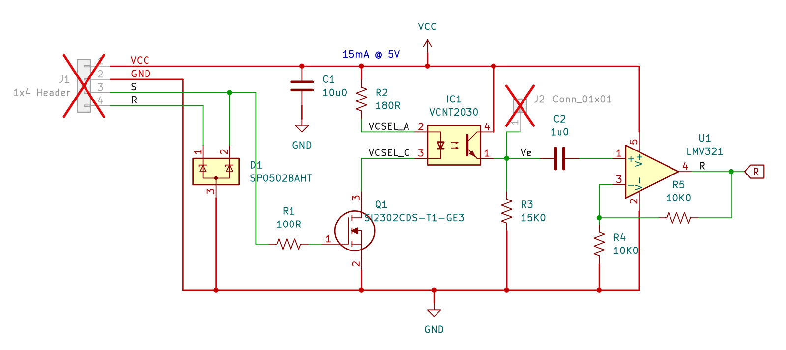
  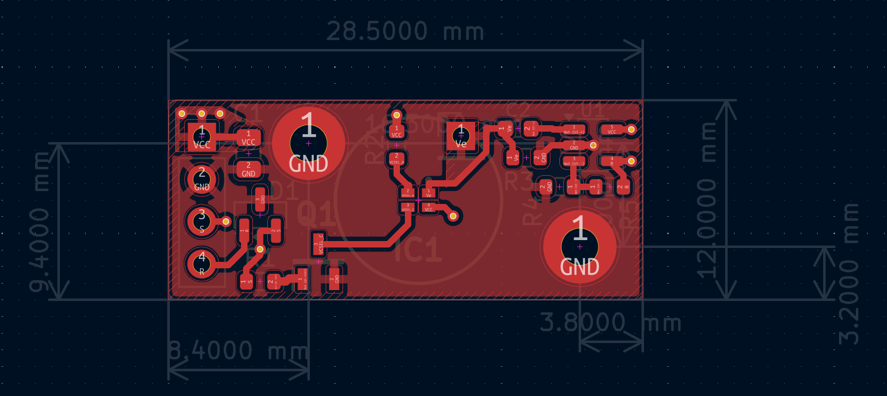
</p>

*Schematic and PCB layout for the VCNT2030 breakout board.*

## Control box

The handheld control box talks to the robot's ESP32-S3 over GPIO/I2C and drives a small SPI TFT menu system ([`src/menu`](code-esp32/src/menu)):

- **Rotary knob**: an AS5600 magnetic angle sensor read over I2C, exposing both cumulative position (for menu scrolling / jogging) and angular speed (smoothed over a rolling 20-sample window) for teleoperation.
- **Three switches**: enter/up/down for menu navigation, jogging, and triggering a deal.
- **Screens**: a homing prompt, a live homing-progress display, and the PID tuning screen shown in the demo above.

<p>
  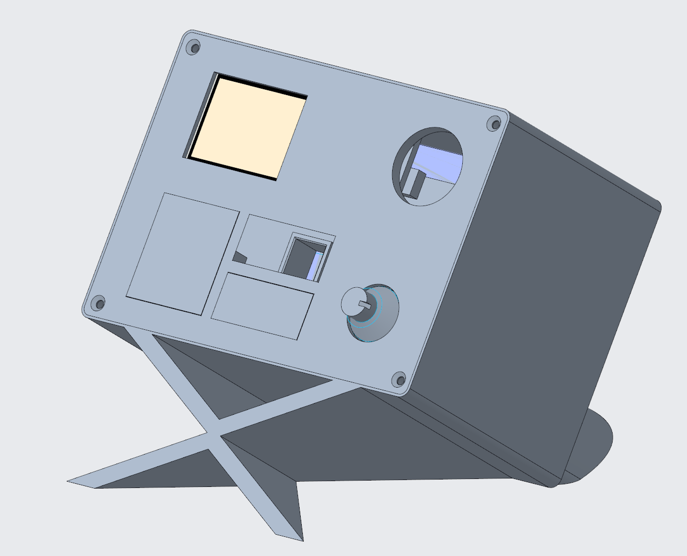
  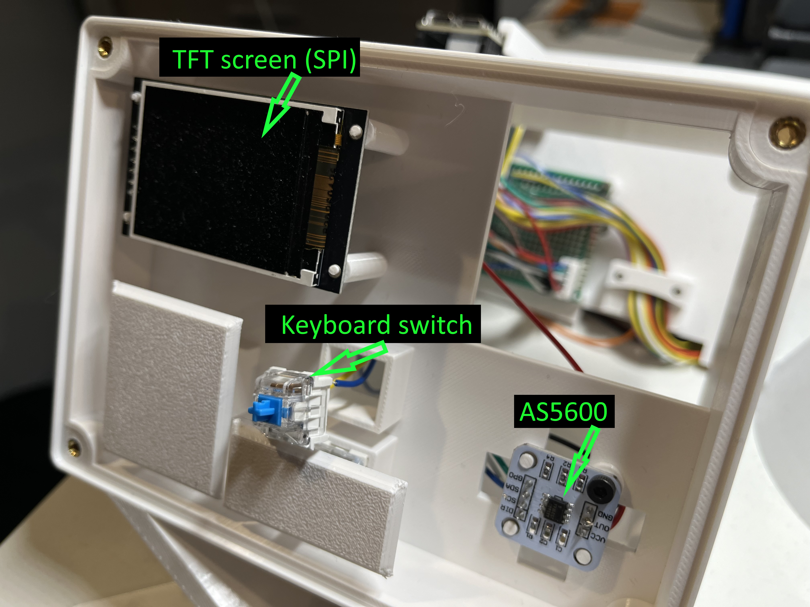
  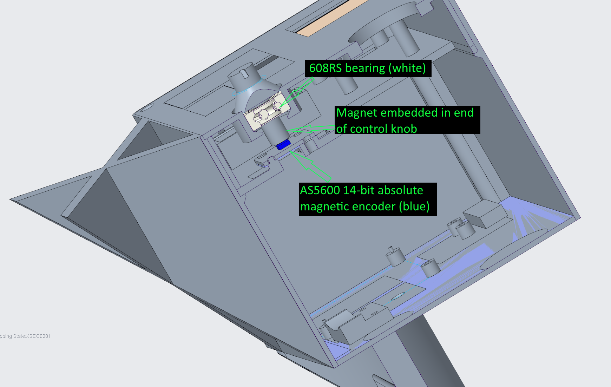
</p>

*Control box CAD, the assembled internals (TFT, switches, AS5600), and a labeled CAD view of the knob/magnet/bearing stack around the AS5600.*

## Hardware overview

<p>
  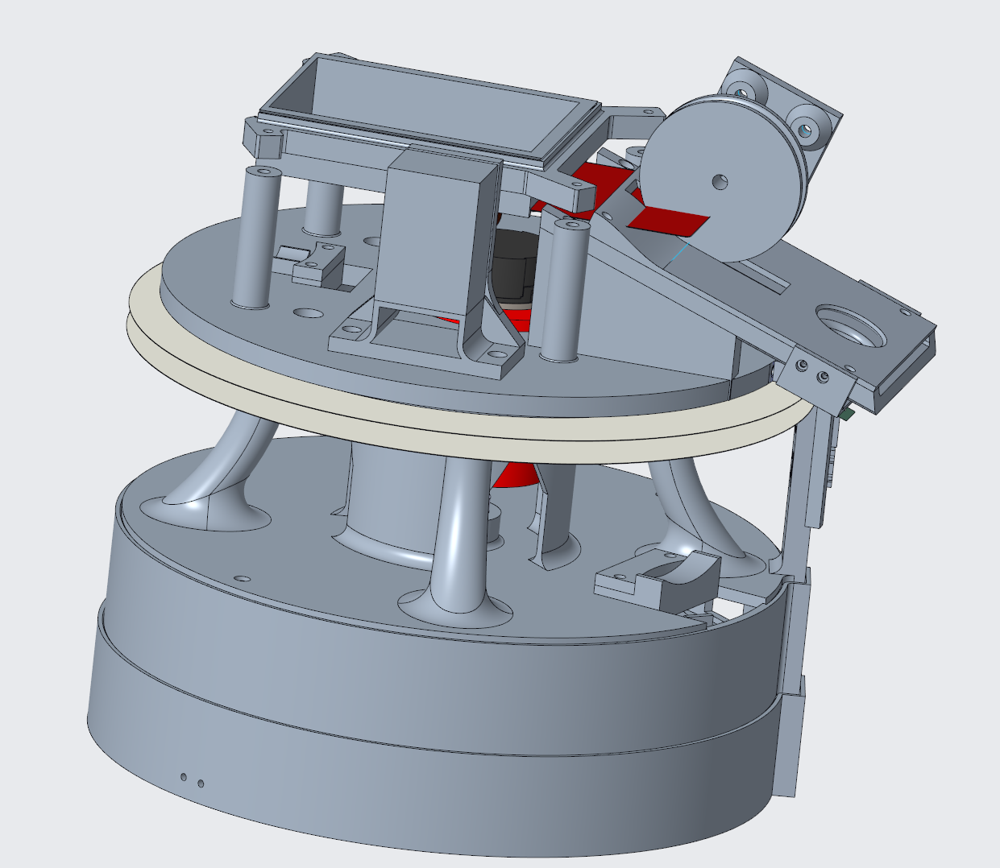
</p>

*The launcher assembly: central axis motor, feeder, launch BLDC, and card holder. Motor drivers and other electronics live under the top panel.*

| | |
|---|---|
| 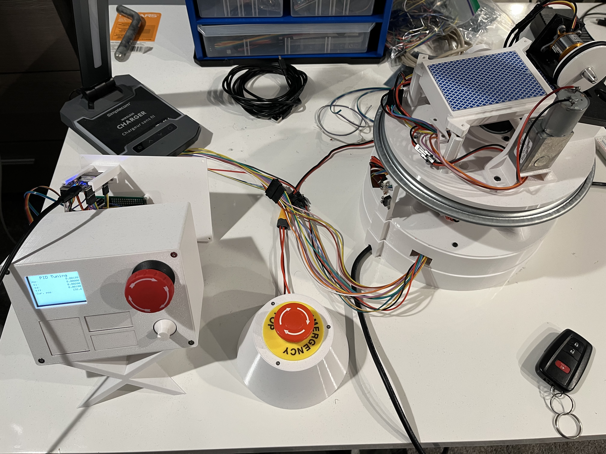 | Most recent version of the robot. |
| 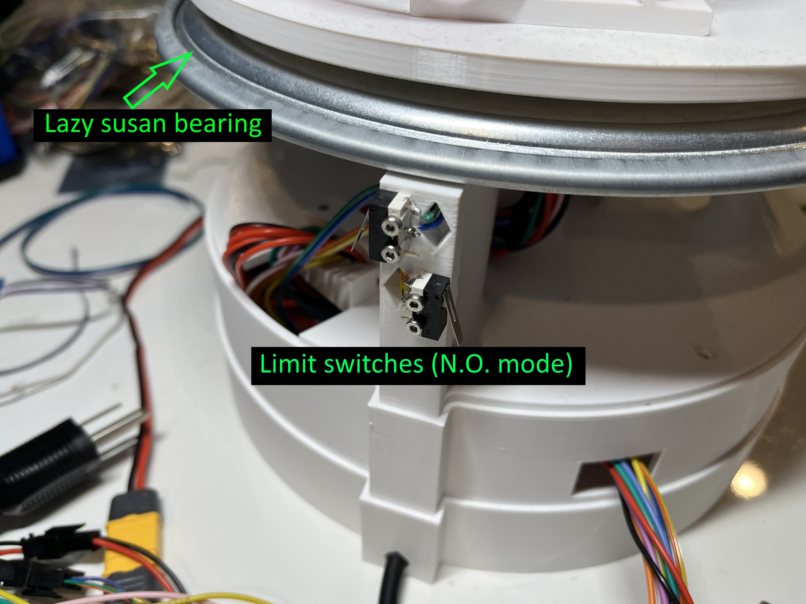 | The lazy-susan bearing the whole apparatus rotates on, and the normally-open limit switches used for homing. |
| 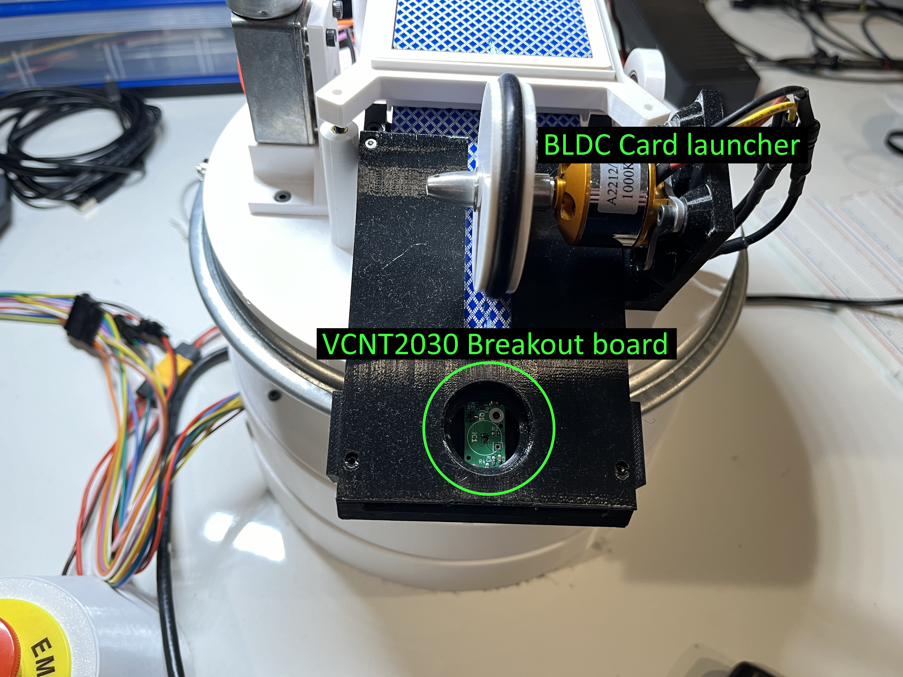 | The BLDC launch motor and the VCNT2030 proximity sensor used to detect a dealt card. |
| 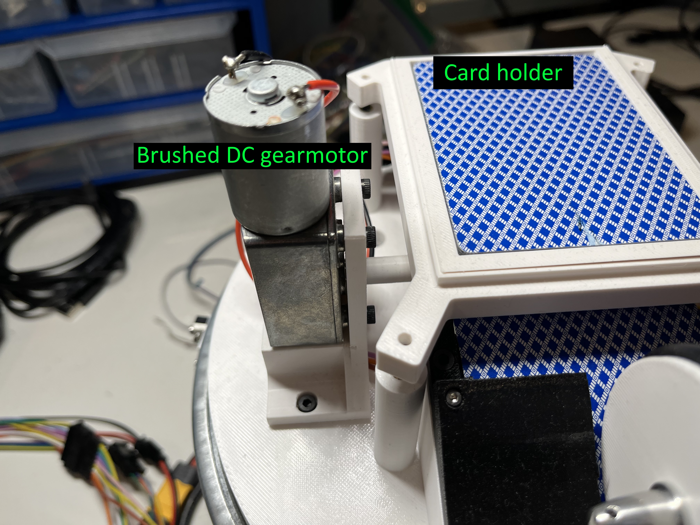 | The worm-gear feeder motor and the card holder. |
| 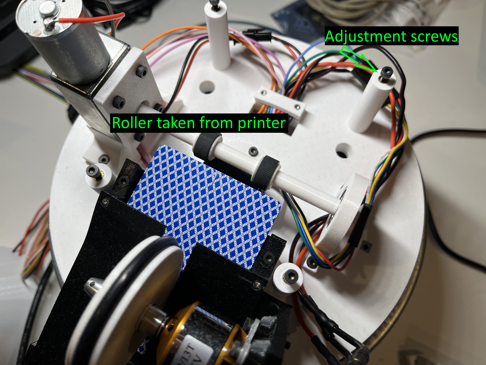 | Feeder rollers repurposed from a printer, and the screws used to adjust card holder height until feeding is reliable. |
| 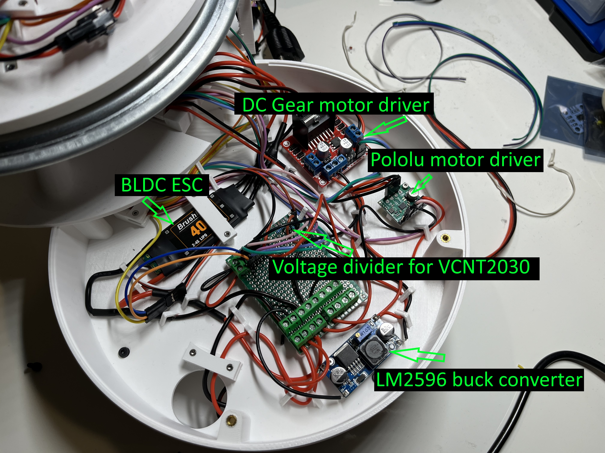 | Motor drivers and power distribution for the whole robot. |
| 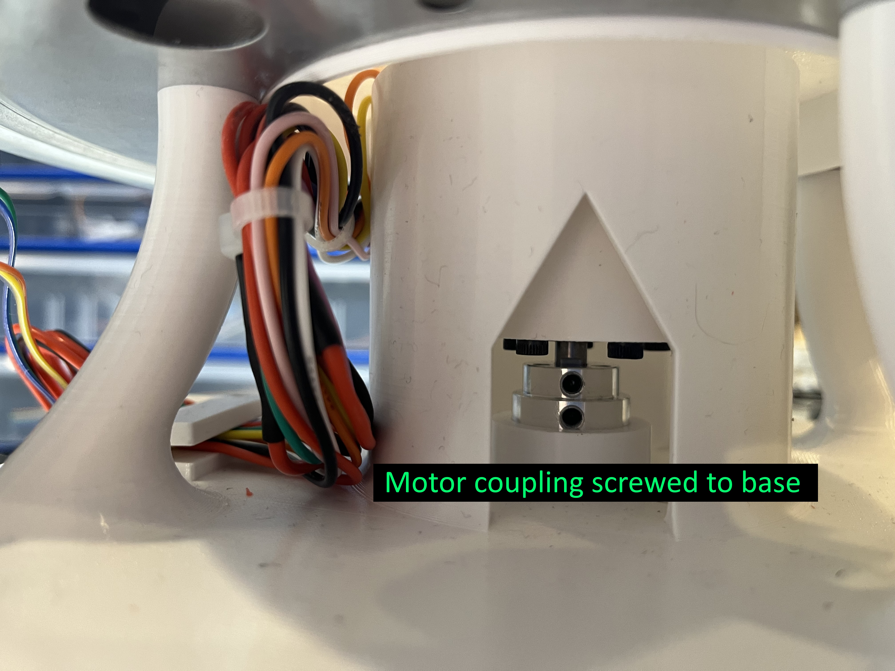 | The coupling between the Pololu motor shaft and the robot's rotating base. |

The card holder's height is adjustable via four screws so the feeder rollers can be tuned to grip reliably across different card stock.

## Code

- [`code-esp32/`](code-esp32): PlatformIO firmware project targeting a Freenove ESP32-S3, Arduino framework.
  - [`src/pid_controller.*`](code-esp32/src/pid_controller.cpp): quintic trajectory planner and the PID+feedforward control loop.
  - [`src/axis_control.*`](code-esp32/src/axis_control.cpp): PWM motor driver, limit switches, and the hardware PCNT quadrature decoding.
  - [`src/robot.*`](code-esp32/src/robot.cpp): homing, `move_to`, and `fire`, the high-level behaviors built on top of `axis_control` and `pid_controller`.
  - [`src/controller.*`](code-esp32/src/controller.cpp): the control box, covering buttons, display, and the AS5600 rotary knob.
  - [`src/components/`](code-esp32/src/components): drivers for the feeder motor, launch motor, and VCNT2030 sensor.
  - [`src/menu/`](code-esp32/src/menu): the TFT menu system and its screens (homing, homing prompt, PID tuning).
- [`plot-pid/`](plot-pid): a Python tool that reads the ESP32's serial output and live-plots any `>plot_name:line_name(x,y)` lines the firmware prints. Any number of plots and lines are picked up automatically; this is what the PID tuning is verified against.
- [`CAD/`](CAD): mechanical design files.
- [`vcnt2030-breakout/`](vcnt2030-breakout): KiCad project for the custom VCNT2030 sensor breakout board.
- [`media/`](media): photos and demo videos.

## Future work

- **Better central axis actuation**: replacing the Pololu gear motor + encoder with a brushless gimbal motor, a [SimpleFOCMini](https://simplefoc.com/) driver, and an AS5600 for direct-drive field-oriented control. This removes gearbox backlash and the encoder-resolution ceiling of the current setup, and opens the door to torque control instead of just position/velocity. The belt-drive test video above is an early prototype of this.
- **Wireless control box**: moving to two ESP32s, one in the control box and one on the robot, communicating over ESP-NOW instead of a cable run between them.
